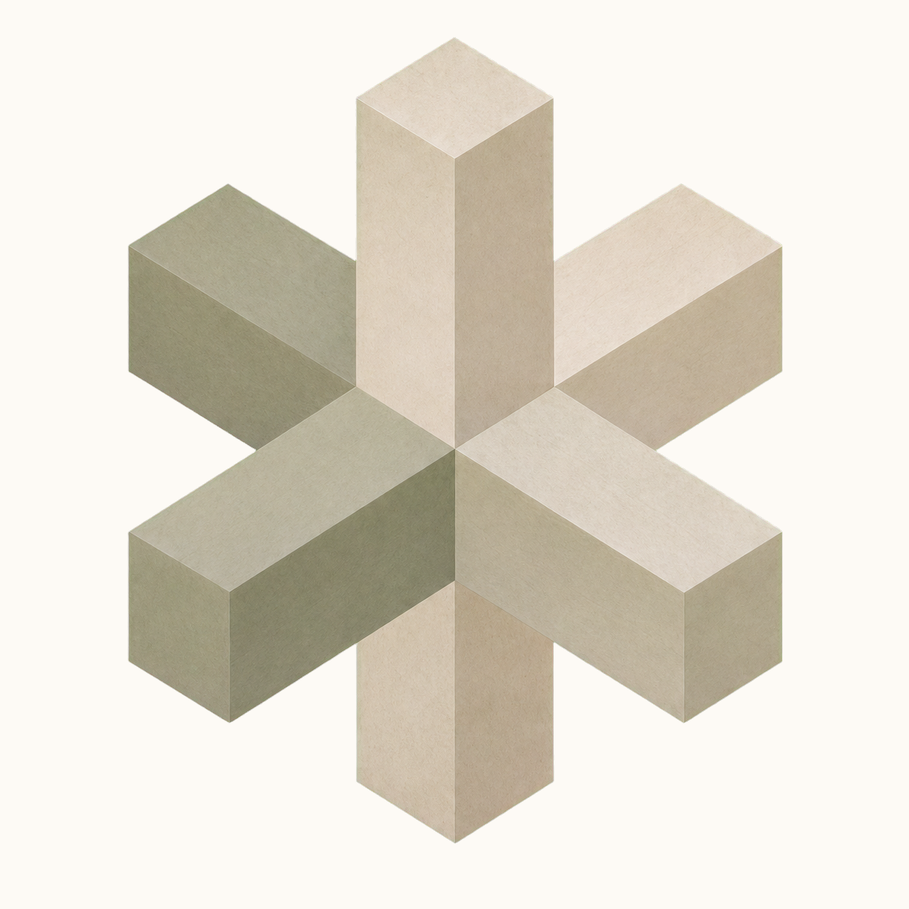

<p align="center">
  <picture>
    <source media="(prefers-color-scheme: dark)" srcset="docs/assets/kigumi-logo.png">
    
  </picture>
</p>

# kigumi(木組)

[English](README.md) | 中文

无钉咬合的木工工艺。LLM 内容流水线的承重结构层——项目(屋顶)与模型(立柱)
之间靠精确咬合连接,不合榫就打回重做。

给"用 coding agent 开发 LLM 流水线"提供地基:

- **注入与拼接**:材料注入唯一入口,严格模板渲染,schema 自动生成格式说明段
- **修复环**:校验不达标 → 纠正指令打回,保留模型上文,有界重试,学费固化
- **确定性重放**:内容寻址缓存,同输入逐字节同输出
- **DAG 编排**(可选):显式节点/item 缓存策略、静态可复用子图、动态 map/scan、
  物化输出所有权、人工检查点与 run diff
- **外部 Agent 节点**:provider-neutral staging、attachment、exact publish、普通 DAG 缓存，
  内容寻址 `AgentSpec` 胶囊与原生、精确版本锁定的 Pi RPC adapter
- **统一实验主体**:函数、Caller、workflow 与 Agent DAG 使用同一隔离证据网格，不自动选赢家
- **守卫四环**:注册环拒载,外加 dag check / pytest 自动收集 / git hook 三个外环,让规矩自动执行

## 快速上手

```python
from pathlib import Path

from pydantic import BaseModel

from kigumi import LiteLLMTransport, LLMCaller, call_validated


class Verdict(BaseModel):
    score: int
    reason: str


transport = LiteLLMTransport(aliases={"default": "anthropic/claude-sonnet-5"})
caller = LLMCaller(transport, cache_dir=Path("artifacts/_llm"), seed=20260713)

verdict = call_validated(caller, "给这段开场白打分并给出理由:……", Verdict)
```

`call_validated` 自动附上由 `Verdict` 生成的格式说明段;返回若不合榫,
带着校验错误打回重试(默认至多 2 次)。整次交互内容寻址落缓存,
同输入重跑逐字节复现,不再计费。

## 状态

0.5.0,API 未冻结。Agent 边界只负责执行兼容与实验取证，不是 Agent factory 或优化器。

## 安装

```bash
uv add "kigumi[litellm]"
```

不装 litellm extra 时可用 `StdlibTransport`(纯标准库 HTTP)或自实现 transport。Pi 是外部
runtime：由用户自行安装、固定版本，并把命令与精确版本交给 `PiRpcAdapter`；Kigumi 不安装或
升级 Node/Pi。staging 与 root-scoped 工具限制模型 I/O，但不是 OS sandbox，可信 Extension
仍有宿主进程权限。

## 文档地图

| 文档 | 回答的问题 |
| --- | --- |
| [DESIGN.md](DESIGN.md) | 为什么这样设计;分层、边界与已裁决的取舍 |
| [docs/adoption.md](docs/adoption.md) | 怎么接入;从单 caller 到 DAG 的路径与排障 |
| [docs/contracts/](docs/contracts/) | 哪些行为是承诺;不变式、失效行为与验证坐标 |
| [docs/reviews/](docs/reviews/) | 某个时点审查出了什么;实然记录,不是规范 |
| [CHANGELOG.md](CHANGELOG.md) | 什么变了;缓存换族与破坏性变更必录 |
| [AGENTS.md](AGENTS.md) | agent 进场先读什么;红线与验证命令 |

## 许可证

[MIT](LICENSE)
